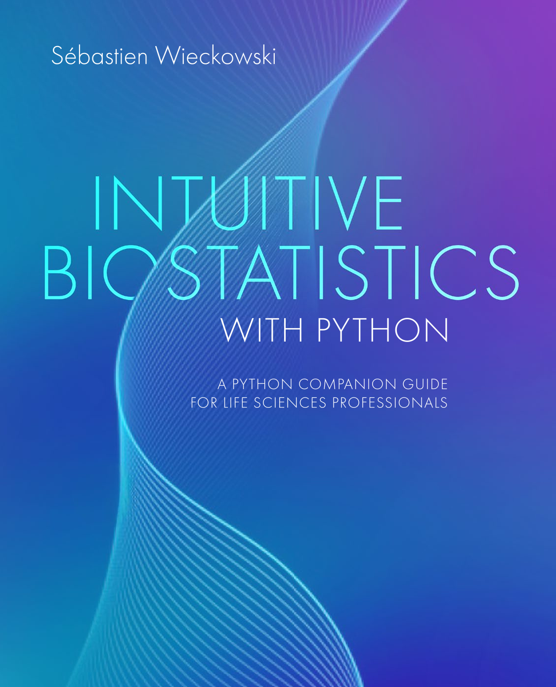

# Intuitive Biostatistics with Python

<p align="center">
  <a href="https://global.oup.com/academic/product/intuitive-biostatistics-with-python-9780197845035?q=sebastien%20wieckowski">
    
  </a>
</p>

Welcome to the official companion repository for the book **Intuitive Biostatistics with Python**. This repository contains all the code snippets, datasets, and future updates related to the text.

## A Note to the Reader (Preface)

While you can clone this repository and run the scripts directly, **I highly recommend typing the code out yourself as you read.** The best way to build an intuitive understanding of biostatistics is through hands-on experimentation. Use this repository as a safety net to check your work, but don't hesitate to break the code, modify the parameters, and most importantly, apply these scripts to your own unique datasets!

## Repository Structure

This repository is organized to be simple and easily navigable. All Jupyter Notebooks correspond directly to the book and are located right in the main directory:

* `*.ipynb`: The Jupyter Notebooks for Chapters 1 through 21, as well as the Appendix A
* `data/`: This directory contains all the CSVs data files required to run the code in the notebooks

## Installation & Running the Code

To get started, you will need Python 3.12 installed on your machine. I recommend setting up a virtual environment before installing the dependencies.

**1. Clone the repository:**

```bash
git clone [https://github.com/sbwiecko/intuitive-biostatistics-python.git](https://github.com/sbwiecko/intuitive-biostatistics-python.git)
cd intuitive-biostatistics-python
```

**2. Create and activate a virtual environment:**

```bash
python -m venv venv
# On Windows:
venv\Scripts\activate
# On macOS/Linux:
source venv/bin/activate
```

**3. Install the required packages:**

```bash
pip install -r requirements.txt
```

**4. Run Jupyter Notebook:**

Once your environment is set up and the packages are installed, launch Jupyter directly from your terminal:

```bash
jupyter notebook
```

This will automatically open a new tab in your default web browser. From there, you can click on any `.ipynb` file to open the chapter's notebook, view the code, and run the cells interactively.

## Get the Book

If you have stumbled upon this repository and want to learn the concepts behind the code, you can grab a copy of the book here:
📚 **[Buy "Intuitive Biostatistics with Python" on Oxford University Press](https://global.oup.com/academic/product/intuitive-biostatistics-with-python-9780197845028)**

## License

The Python code in this repository is released under the [MIT License](https://www.google.com/search?q=LICENSE). You are free to use, modify, and distribute it.

*Note: The explanatory text, theories, and concepts in the accompanying book are copyrighted by Oxford University Press.*
